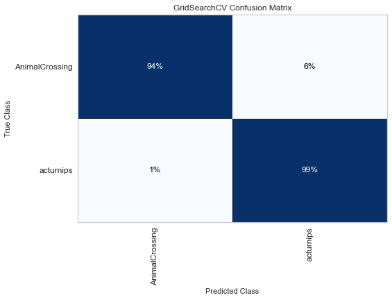

# Project 3: Animal Crossing  

Animal Crossing is a Nintendo game series, and the fifth and most recent edition, New Horizons, was released at the end of March of this year. As a result, sales skyrocketed. The Verge reports that the companies operating profit is up 428%, and the sales of the console used for the game, the Nintendo switch, are up 166%. As of the beginning of August, 22.4 million copies of the game have been sold. Of the 5.68 million consoles sold, more than half of those played Animal Crossing on the first day of use. The game is simple and family friendly- the main premise is that you move to an island and create your own little paradise. If you’re able to read, you’re old enough to play. However, this game, originally marketed towards children, has generated an online dynamic and following that revolves around intricate economy, multiple blogs- and apps and websites built using scraped or mined data. There are over a dozen subreddits dedicated to the franchise, with the largest having almost 1 and half million followers.   

As a player of the game, I have used a number of the tools built on data mining and scraping, and I wanted to contribute my own. I decided to build a model that could predict which subreddit a post came from, and use the model to build a tool so that players could input text of a drafted post, and get a returned subreddit that is likely to accept that post, answer a particular question, or already have an answer! Success of the model will be evaluated based on prediction accuracy. 

The initial two subreddits I used were AnimalCrossing and ac turnips. The subreddits are fairly different; AnimalCrossing is predominantly pictures with only titles for text, whereas ac turnips is primarily dedicated to the buying and selling of turnips with other players- an optimal way to make money in the game. A total of 1000 posts were scraped from each subreddit, with the function scraping 100 posts each time, with a three-second delay between each request.  

After scraping, the data was cleaned. The columns subreddit (name of the subreddit the post originated from), title (the title of the post), and selftext (the text of the post) were saved in a dataframe. Title and selftext were combined, and then the two dataframes, AnimalCrossing and acturnips, were merged. Null rows were identified and dropped, and only five rows were removed in this cleaning. The final dataset, with 1,995 rows, is substantial enough to build an initial model on.  

The first model fit was K Nearest Neighbors. The data was count vectorized, the English stop words list was used, and train test split was performed. The K Nearest Neighbors model was fairly strong; it predicted about 90% of the data in the testing dataset. The following confusion matrix details the percentages of correct and incorrect predictions.   
  

The second model fit was Logistic Regression. It fit twice; once with the English list of stopwords, and once with the two additional stopwards buying and selling, which appear in almost every acturnips post, but very rarely in AnimalCrossing posts, thus it was suspected it might be a significant predictor. However, the differences were miniute - with buying and selling, the overall prediction rate for the testing dataset was 97%; without it fell to 96%, so only a one percent overall change. The following confusion matrixes detail both these models.    
  

  

While the current models perfrom very well, in the future, I want to scrape more subreddits- the next two I plan to scrape are AC Trade, a trading subreddit, and AC QR, a subreddit for sharing custom designs. Additionally, I want to scrape more than 1,000 posts per subreddit, to see if that has any effect on the models. I also want to test more models, to see if after adding more subreddits, a different model is a better fit. I aim to work on turning the model into an actually usable web application, so that people who are just getting started with the game will be able to use it as a resource to find the subreddits most helpful for them.